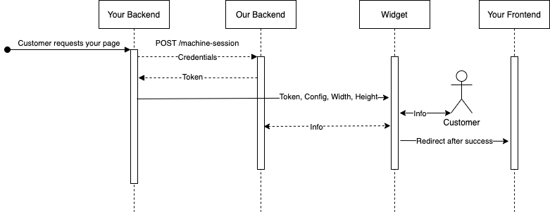
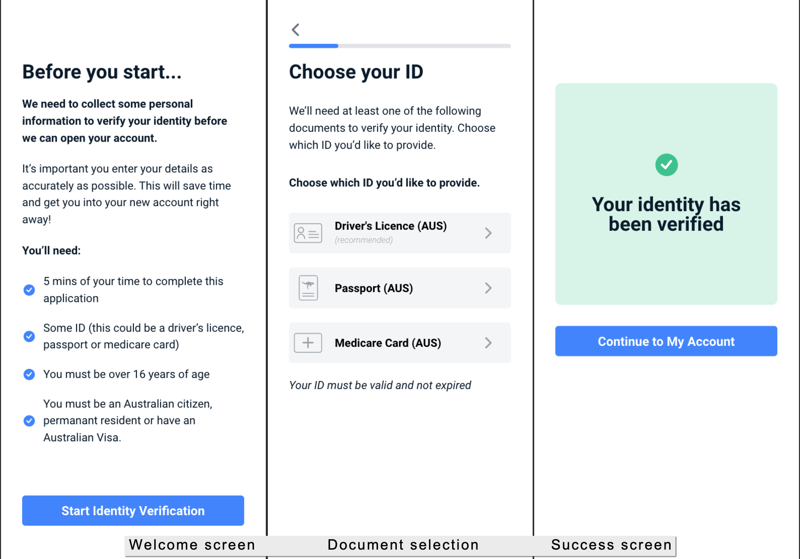
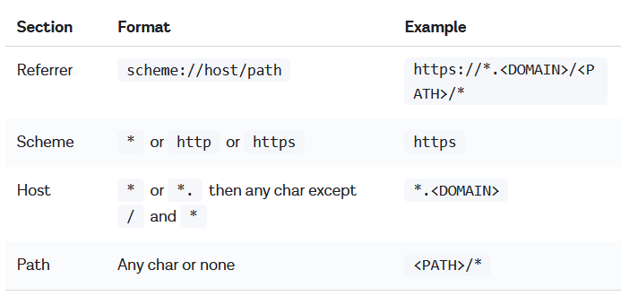
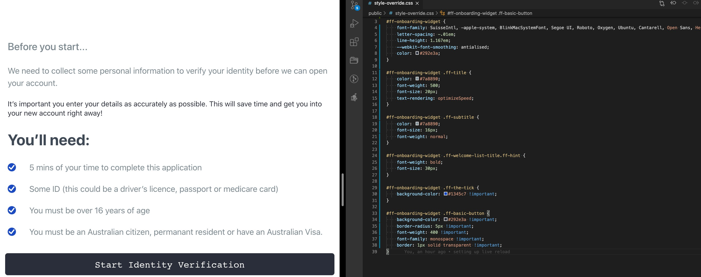
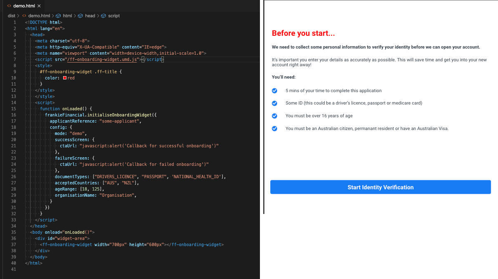
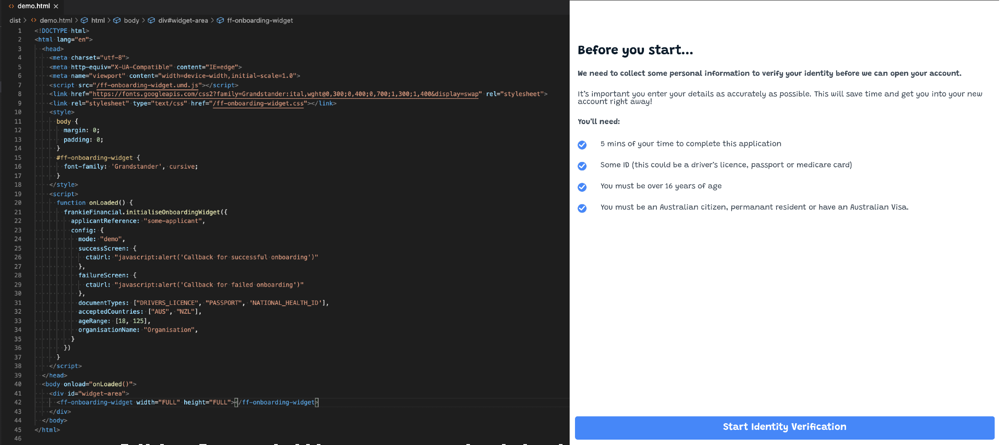
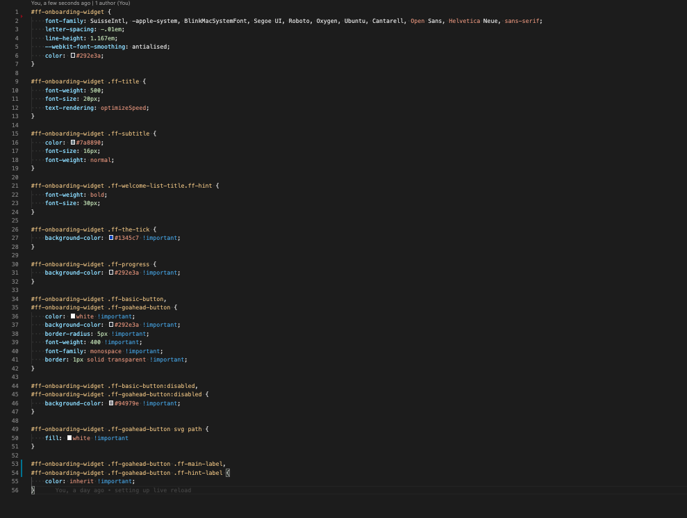

# Frankie Smart UI Onboarding Screens

#### https://assets.frankiefinancial.io/onboarding/latest/ff-onboarding-widget.umd.min.js

## Table of contents

- [Overview](#overview)
- [Demo](#demo)
- [Getting started](#getting-started)
- [Configuration](#configuration)
- [Custom Styles](#styling)
- [Changelog](#changelog)

## Overview

Our self onboarding Smart UI allows you to connect your customers directly with Frankie Financial's identity verification and validation services.
They will provide their minimum basic information, we will run all the checks you choose and then signal back to you that the Applicant is ready to be onboarded, right there in the platform it's embeded.

- The first step is to make sure you have credentials previously provided to your organisation by Frankie: the Customer ID and the api key. Some organisations will also have a Customer child ID.
- With those in hand you will be able to authenticate to our backend service and generate a secure temporary token that will allow the Smart UI to connect to Frankie Services with limited permissions.
- Now you only need to provide the Smart UI with that token and optional configuration to customise the behaviour to meet your own goals.

Simply put, the Smart UI is a reusable Web Component or "widget".

## Get either the .min.js or the .js file from the folder "static" in this repository



## Demo

To see the Smart UI in action, please run the demo script in this repository, as follows.

**If you don't have Frankie credentials** or were not provided a Frankie backend URL

```shell
npm install
npm run start:demo
```

The Web Component in "demo" mode is configured to not expect authentication and will show you buttons to fake check results in the end of the process.

**If you have Frankie Developer Credentials**

If you've received your developer welcome email and welcome pack, you'll be using the demo service API which is:

https://backend.demo.frankiefinancial.io

You will need to pass this in to the configuration object. See details on the [configuration object](#configuration) below on how to pass this URL into the Smart UI.


**If you have Frankie Production Credentials**

Some organisations may be issued their own specific Frankie environment and will therefore have a dedicated URL to use. See details on the [configuration object](#configuration) below on how to pass this URL into the Smart UI.

If you're using the standard production service, there is no extra step - the default URL will go to the primary production backend service.


First create a .env file with the following variables

```shell
FRANKIE_API_KEY=...
FRANKIE_CUSTOMER_ID=...
FRANKIE_CUSTOMER_CHILD_ID=... <only required if you have one>
FRANKIE_API_URL=...
```

Generate ssl keys, server.cert and server.key, in the root of this project to allow running a secure server locally.

**ON MACOS** You can simply run the following helper and answer all the questions to generate the ssl keys.

```shell
npm run mk-ssl
```

**Other OS**
[https://github.com/FiloSottile/mkcert](https://github.com/FiloSottile/mkcert)

and then, to run the demo script

```shell
npm install
npm run start
```



## Getting started

1. Serialise and base64 encode your Frankie Api Credentials using ":" as a separator
    - "CUSTOMER_ID:API_KEY", if you don't have a CUSTOMER_CHILD_ID
    - "CUSTOMER_ID:CUSTOMER_CHILD_ID:API_KEY" if you do
2. Post the credentials in the header parameter "authorization" to ${frankieUrl}/auth/v1/machine-session with an optional (but highly recommended) **referrer** field in the JSON body

Header
```
authorization: machine {encoded credentials}
```
**Optionally include a field "referrer" in the request's body, with the pattern to be used to verify the url from which calls can be made using the token.The referrer sent by the browser must match the referrer URL pattern in the JWT for the Smart UI to successfully authenticate**

*The referrer is based on the Google Chrome match pattern URLs. URLs can contain wild card characters. You can read more about it here [ match pattern](https://developer.chrome.com/extensions/match_patterns)*.

**Permitted referrer patterns are as follows:


An example of a valid referrer is
```
https://*.example.com/example_page/*
```

Whilst not required, this option is highly recommended, as it secures your short lived token from being used from unknown sources and guarantees that other malicious websites cannot reuse the JWT in case it is lost. The only reason not to use it is in the case that your frontend is configured not to send Referer (sic) headers. [Read more](https://developer.mozilla.org/en-US/docs/Web/HTTP/Headers/Referrer-Policy).

Body
```
{
    "referrer": "https://the-company.com" || "*://the-company.com/*"
}
```
3. The response will contain a short lived api token in the header parameter "token"
*This token is valid for 1 hour and is refreshed on each successful call to the backend.*
```
token: {Frankie generated token}
```
4. Add both the link to the desired font family and script tag to the Smart UI .js file in the head of the webpage. Since v2.3.0 you also need to initialise the Smart UI by calling a global javascript function, where you pass the [configuration](#configuration) object and the applicant reference. The initialisation needs to be done after the page is mounted, so the widget element is already available. In plain html that is in the event body.onload (see snippet below).
    1. "Applicant reference number" is your own internal ID. If you have previously sent this data to Frankie, the service will automatically retrieve that data and attempt to pre-populate this Smart UI with the data available.
```
<link href="https://fonts.googleapis.com/css2?family=Roboto:ital,wght@0,300;0,400;0,700;1,300;1,400&display=swap" rel="stylesheet">
<script src="https://assets.frankiefinancial.io/onboarding/latest/ff-onboarding-widget.umd.min.js"></script>
<script>
    function onLoaded() {
        frankieFinancial.initialiseOnboardingWidget({
            applicantReference: "some-applicant",  /// the string reference that will be injected into this applicant's data, will be used to prefill data and can be used to request their details aftwerwards, both via Frankie API and Frankie Portal
            config: {  /// the configuration object, see the configuration section below
                successScreen: {
                  ctaUrl: "javascript:alert('Callback for successful onboarding')"
                },
                failureScreen: {
                  ctaUrl: "javascript:alert('Callback for failed onboarding')"
                },
                documentTypes: ["DRIVERS_LICENCE", "PASSPORT", 'NATIONAL_HEALTH_ID'],
                acceptedCountries: ["AUS", "NZL"],
                ageRange: [18, 125],
                organisationName: "My Organisation",
            }
        });
    }
    var body = document.getElementsByTagName("body")[0];
    document.addEventListener('DOMContentLoaded', onLoaded);
</script>

```
6. Add the web component to the page, passing the following attributes
    1. **ff**, the token
    2. *optional* **width**, the width exactly as would be defined in css OR the default "FULL". When this attribute is the string "FULL", the calculated screen size width is used.
    3. *optional* **height**, the height exactly as would be defined in css OR the default "FULL". When this attribute is the string "FULL", the calculated screen size height is used.

## 1. Obtaining an API token

Example in Node + Express + Axios

```javascript
  // Have your Frankie credentials in hand
  const apiKey = process.env.FRANKIE_API_KEY,
        customerId = process.env.FRANKIE_CUSTOMER_ID,
        customerChildId = process.env.FRANKIE_CUSTOMER_CHILD_ID;

  // Set the applicant reference to any html compatible string you can use to identify
  //   this applicant, this will help us to preload applicant data and directly display the
  //   applicant details review page if an applicant already exists.
  // Note: the example here is just that. Use your own unique identifier.
  const applicantReference = Math.floor(Math.random() * 9999) + "-new-applicant";

  // Set Smart UI configurations as defined in "Configuration"
  const widgetConfiguration = {
    mode: process.env.NODE_ENV,
    documentTypes: ['PASSPORT', 'DRIVERS_LICENCE', 'NATIONAL_HEALTH_ID'],
    maxAttemptCount: 5,
    googleAPIKey: process.env.GOOGLE_API || false,
    frankieBackendUrl: process.env.FRANKIE_API_URL,
    checkProfile: process.env.CHECK_PROFILE,
    acceptedCountries: ["AUS", "NZL"],
  };

  // Serialize your credentials, by joining them with a ":" separator symbol
  //   customerId:customerChildId:apiKey OR customerId:apiKey
  //   where if you don't posses a customerChildId, you should omit it and the
  //   separator symbol ":" all together
  const decodedCredentials = [customerId, customerChildId, apiKey].filter(Boolean).join(":");

  // Base64 encode the result string
  const encodedCredentials = Buffer.from(decodedCredentials).toString('base64');

  // POST the endpoint "/machine-session" of the api service provided to you by Frankie
  // Include the encoded credentials in the "authorization" header, as follows
  // "authorization": `machine ${encodedCreentials}`
  // and extract the header "token" from the response
  const frankieUrl = process.env.FRANKIE_API_URL;
  axios.post(`${frankieUrl}/auth/v1/machine-session`, {}, {
    headers: { authorization: "machine " + encodedCredentials }
  }).then(data => {
    const headers = data.headers;
    const ffToken = headers.token;
    // pass the extracted token to the Smart UI as an html attribute called 'ff' (see "Embedding Smart UI" below)
    res.render('the-web-page.ejs', {
      title: "Frankie Financial Smart UI Demo",
      ffToken: ffToken,
      widgetConfiguration,
      applicantReference
    });
  })
```

## 2. Embedding Smart UI

Head of the html page (link to font and the js file)

```html
  <head>
    <!-- viewport meta is recommended for responsive pages -->
    <meta name="viewport" content="width=device-width, initial-scale=1.0">
    <!-- install your font, if you don't already have it -->
    <link href="https://fonts.googleapis.com/css2?family=Roboto:ital,wght@0,300;0,400;0,700;1,300;1,400&display=swap" rel="stylesheet">
    <!-- Include the Web component script -->
    <script src="https://assets.frankiefinancial.io/onboarding/latest/ff-onboarding-widget.umd.min.js"></script>
    <script> /* initialisation as mentioned above, in "Getting started" */ </script>
  </head>
```

Body of the html page, wherever desired. The token will be stripped out of the html as soon as it's read.

```html
<body>
    <ff-onboarding-widget width="500px" height="900px" ff="<%= ffToken %>"></ff-onboarding-widget>
</body>
```

## Configuration

More configurations and customisations will be available soon. Right now our goals are the following.

- [x] Customize/Disable Welcome Screen
- [x] Customize accepted document types
- [x] Customize maximum attempt count
- [x] Hide the progress bar
- [x] Customize accepted country of residence
- [x] Customize success page redirect url
- [x] Customize font
- [x] Customize all styles freely
- [ ] Dispatch events on every step of the progress of the user to allow greater interaction between the host platform and the Smart UI
- [ ] Reduce file size by splitting it in multiple assets hosted by Frankie.
- [ ] Customize success page content
- [ ] Create public credentials that can be used directly by the frontend, with no backend required
- [ ] Customize text throughout the Smart UI
- [ ] Customize progress bar range, start value and end value

## All current options and their defaults

```typescript
// not necessary to change this options. It's simply a switch between "development",
//   "demo" and "production"
mode: 'demo' | 'production' | 'development' = 'production',

// if your organisation has a special Frankie Backend URL, provide it here. If that's not applicable in
//   your case, skip this configuration.
frankieBackendUrl: string = "https://defaults-to-valid-frankie-url",

// array of accepted document types
// where DocType = 'PASSPORT' | 'DRIVERS_LICENCE' | 'NATIONAL_HEALTH_ID'
documentTypes: DocType[] = ["PASSPORT", "DRIVERS_LICENCE", "NATIONAL_HEALTH_ID"]
// to hide the welcome screen, simply make welcomeScreen === false
welcomeScreen: boolean | {
  // html string to be displayed in the welcome screen. It accepts style tags,
  //   but script tags will be stripped out.
  // the default welcome screen (htmlContent === null) is available in the screenshot at
  //   the end of section "Demo" above
  htmlContent: string | false | null = null,
  ctaText: boolean | string = "Start Identity Verification"
}

// the number of times the applicant will be allowed to review personal details and try
//   new documents before failing their application
maxAttemptCount: number = 5

successScreen: {
  // url to redirect after applicant clicks button in the successful page
  // by default (ctaUrl === null) the Smart UI only displays a successful message
  // you can always include the applicant-reference as a query parameter to continue any
  //    remaining onboarding steps that might come after the identity verification.
  // As any traditional html link, ctaUrl can also include a call to a global
  //    javascript function, "javascript:ffSuccess('string-with-applicant-reference')"
  ctaUrl: string | null = null
  ctaText: string = 'Continue to My Account'
}

failureScreen: {
  // url to redirect after applicant clicks button when onboarding has failed
  // by default the Smart UI only displays a failure message
  // you can always include the applicant-reference as a query parameter to provide any further steps.
  // As any traditional html link, ctaUrl can also include a call to a global javascript function,
  //   "javascript:ffFailure('string-with-applicant-reference')"
  ctaUrl: string | null = null,
  ctaText: string = 'Contact Us'
},

// If the progress bar should be rendered
progressBar: boolean = true

// A "profile" is a collection or recipe of rules and checks that you wish to perform
//   on all of your customers.
// As part of the onboarding process with Frankie, we'll work with you to define these.
// However, the service also makes it easy to automate this and you can just use "auto"
//   to have our rules engine work this out for you.
// Unless told otherwise by Frankie, use "auto".
checkProfile: string = "auto"

// Google api key for the address auto complete. For the demo we provide our own api automatically.
// Otherwise if this field is missing the Smart UI will skip the address autocomplete screen.
// More information right after this code bloc
googleAPIKey: string | false =  false

// List of up to 5 char3 country codes to include in the country selects in the Addresses
//   form. Otherwise all countries will be displayed.
// ex ["AUS", "NZL]
acceptedCountries: char3[] | null = null

// Tuple of two numeric values minimumAge and maximumAge in the exact order
ageRange: [number, number] = [18, 125];

// Your organisation's name as displayed in the data submission consent text. Defaults to the name we have on record.
organisationName: string = <Organisation name as configured during Frankie onboarding process>

// Consent text to be displayed in the review page. Defaults to null, which will display our generic consent text
// `I consent to the collection, use and disclosure of my personal information in accordance with
//  ${organisationName} Privacy Policy, and consent to my personal information being disclosed to a
//  credit reporting agency or my information being checked with the document issuer or official record holder
//  in connection with a request to verify my identity in accordance with the AML/CTF Act`;
consentText: string | null = null

// When true the user will be required to include an address, when false the address pages are skipped.
// When loading an existing applicant, if requestAddress is true and applicant doesn't have an address yet,
// one will be included and the user will be required to input their address details. Defaults to true, including the address pages by default.
requestAddress: boolean = true

```

## To obtain a Google API key

please visit the [Google Developer Console](https://console.developers.google.com/). \
The API's that you have to enable in your Google API Manager Dashboard are **Google Maps Geocoding API, Google Places API Web Service and Google Maps Javascript API**.

## Passing the configuration object to the Smart UI

Since HTML attributes can only be strings, the configuration object needs to be serialised and URI encoded before it's included in the Smart UI's attribute **config**

```javascript
encodeURI(JSON.stringify(widgetConfiguration));
```

Example configuration object

```javascript
  const widgetConfiguration = {
    frankieBackendUrl: "https://backend.frankiefinancial.com" // not real. don't use this value.
    documentTypes: ['PASSPORT'],
    maxAttemptCount: 2,
    welcomeScreen: {
      htmlContent: `
        <h1 class='title'>The title</h1>
        <p class='bold'>We need to collect some personal information to verify your identity before we can open your account.</p>
        <ul style=''>
          <li>We need 5 mins of your time to complete this application</li>
          <li>You must be over 16 years of age</li>
        </ul>
        <style>
          ul {
            list-style-image: url(/bullet.png);
          }
        </style>
      `,
      ctaLabel: 'Identify me!',
    }
    successScreen: {
      ctaLabel: "Create Account :)",
      ctaUrl: "https://my-organisation.com/create-account?applicant=99-custom-applicant-id&secret-token=hash_to_validate_99-custom-applicant-id"
    }
    failureScreen: {
      ctaUrl: "https://my-organisation.com/contact-us?applicant=99-custom-applicant-id$secret-token=hash_to_validate_99-custom-applicant-id",
      ctaText: 'Contact Us'
    },
    progressBar: true,
    checkProfile: "customer",
    googleAPIKey: false
    acceptedCountries: ["AUS", "NZL"],
    ageRange:[18, 125],
    organisationName: "organisation"
  };

```

The **config** attribute

```html
<body style="margin: 0">
  <ff-onboarding-widget
    width="500px" height="900px"
    ff="<%= ffToken %>"
    config="<%- encodeURI(JSON.stringify(widgetConfiguration)) %>"></ff-onboarding-widget>
</body>
```

## Styling
Since v2.3.0, the shadow DOM was removed and external styles can now target elements within &lt;ff-onboarding-widget>. This means it's now possible to customize it to look like it belongs to the host platform.
While that is an advantage overall, it also means some unintentional styles may be injected into the Smart UI and have undesireble effects. Most websites and web applications don't use generic element selectors as they don't target anything specific, but let us know if your platform requires a version which is isolated using the shadow DOM. (examples below)


Selectors throughout the Smart UI are intended to facilitate overriding their styles, but we're open to suggestions and requests on how to make style override simpler. Here is a quick guide on how to override styles:
1. The font-family for the Smart UI can be changed targeting the root #ff-onboarding-widget. Any font-family available on the page can be used. The default styling expect the following font weights and styles, where weights fallback to the closest available one:
    1. 300, Regular
    2. 300, Italic
    3. 400, Regular
    4. 400, Italic
    5. 700, Regular
2. Selectors are prefixed with "ff-", to avoid targetting external elements
3. Page titles can be targeted with .ff-title
4. Page subtitles can be targeted with .ff-subtitle
5. Every page has multiple levels of containers, which can be used to target specific views. They are named View, Form and Input, but that only refers to how they access data internally and has no meaning to how they should be displayed or how they behave externally, so you may disregard that naming. In the list below, an item in the form [class &&] followed by an indented inner list means that class is appended with one of the following listed classes. Otherwise idented inner lists mean they are contained within the parent class. Elements usually have multiple intermediary containers not mentioned here, so avoid using the direct child selector (>).
    1. .ff-welcome-view
    2. .ff-initial-data-view
        1. .ff-document-form
            1. .ff-document-type
            2. [.ff-document-input &&]
                1. .ff-passport-input
                2. .ff-medicare-input
                3. .ff-licence-inputs-container
        2. .ff-personal-details-form
            1. .ff-fullname-input
            2. .ff-dob-input
            3. .ff-address-input
                1. .ff-address-autocomplete
                2. .ff-address-manual-input
    3. .ff-details-review
        1. .ff-document-review-input
        2. .ff-applicant-review-input
        3. [.ff-the-input &&], which is the specific form being reviewed, shown after clicking the pen to edit that specific field. It will also have one of the following classes that have been shown before in .ff-initial-data-view
            1. [.ff-document-input && specific document type] same as .ff-document-input above
            2. .ff-fullname-input
            3. .ff-dob-input
            4. .ff-address-manual-input
    4. .ff-no-match, which contain revision for personal details
        1. .ff-warning-no-match
        2. .ff-personal-details-form and its children, same as above
    5. .ff-partial-match, which contain revision for document details
        1. .ff-warning-partial-match
        2. .ff-review-document and same children as .ff-details-review, but only for documents
        3. .ff-document-form, same as .ff-document-form above
    6. .ff-warning-success
    7. .ff-failure-view
6. Most basic elements come from our external component library and for that reason they have stronger targeted styles. They are elements such as Form Inputs, Progress Bar, Dropdowns, Check Boxes, Buttons and What we call Go Ahead Buttons, which are Buttons with an Icon, Label Text, Hint text and an Arrow icon pointing to the right. They can still be targeted but might require greater specificity, including the use of !important rules. Their inner structure is the following.
    1. Button
        1. button.ff-basic-button, which is a simple button element
    2. Go Ahead Button
        1. button.ff-goahead-button
          2. .ff-icon, the custom icon
          3. .ff-label
              1. .ff-main-label, title in bold
              2. .ff-hint-label, small italic hint below title
          4. .ff-arrow, the arrow icon
    3. Progress Bar
        1. .ff-progress-bar, grey container
            2. .ff-progress, the action progress, in blue
    4. Check Box
        1. .ff-the-tick
            1. .ff-icon
        2. .ff-label, all text associated with the check box
    5. SelectOption (dropdowns that might also be displayed as a full spread list of options for better UX on small screens)
        1. .ff-select-option, when it's a regular dropdown is just a wrapper for a [third party library](https://vue-select.org/)
            1. .ff-the-select-box, the third party element
        2. .ff-select-option.ff-spread, in case the options list is spread on the screen instead of a dropdown, which makes it a sequence of ul li
            1. .ff-select-option-filter, the filter text input that might be present or not, based on configuration. See details in Generic Input
            2. ul.ff-select-option-options, the actual options list
            3. li.ff-select-option-label, some spread lists might have a first static list item that is simply a label for the list
            3. li, all the option list items
    6. Generic Input, the basic inputs such as text and number input
        1. .ff-generic-input
            1. .ff-label, contains the label text and might contain other elements
            2. input, the basic native html input element
7. Regarding the disabled state
    1. Button and Go Ahead Button have a disabled state that can be targeted with the attribute selector [disabled]
    2. Generic Input will have .ff-disabled in its root .ff-generic-input element, and [disabled] in the native input element
    3. Select Option will contain .ff-disabled in its root
8. Regarding focused state
    1. Being a wrapper for a native html input, the Generic Input element :focus state can be targeted directly .ff-generic-input input:focus, to change the default border surrounding it
9. Other states will still be made available


### Adding styles using javascript
Of course, it's not necessary to include stylesheets in such a 90's manner. Styles injected via bundler's such as webpack will work without any issues. Another way is to inject them manually
```javascript
var style = document.createElement('style');
style.innerHTML = `
  #ff-onboarding-widget {
    font-family: "Comic Sans MS"
  }
`;
document.head.appendChild(style);
```


## Custom Styles



## Initialisation in script tag and custom styles.
This is in demo mode, so ff-onboarding-widget tag is missing the token in ff attribute


## Changing font


## Custom Styles



## Changelog

#### Changelog of September 9th v2.2.0 -> v2.3.0
1. Frankie Smart UI is now hosted by Frankie on https://assets.frankiefinancial.io/onboarding/latest/ff-onboarding-widget.umd.min.js
2. Minor improvements in responsive design.
3. Fix for Safari bug detecting blur event on date of birth inputs.
4. Preload of customers data added. Only applies when applicant is found on Frankie's database using "applicantReference".
5. White labeling added. This allowes external styles to penetrate all components within the Smart UI.
6. New function for initialising Smart UI, without needing to manually serialise configuration. This also clears attributes from the root of the html element.
