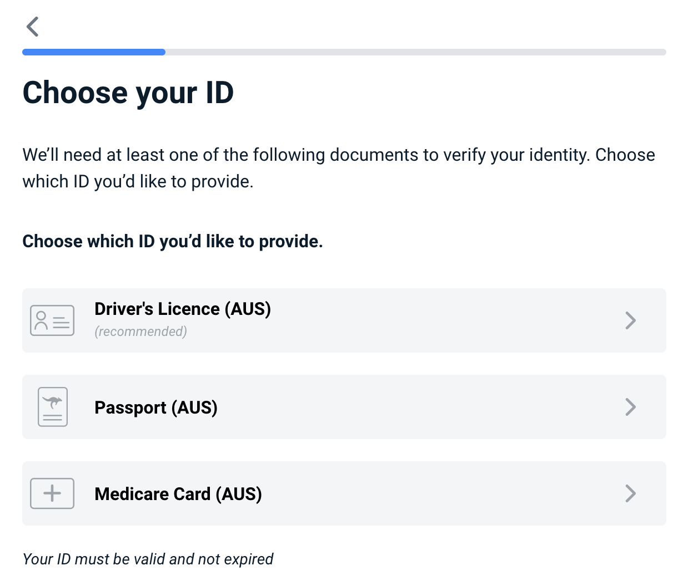
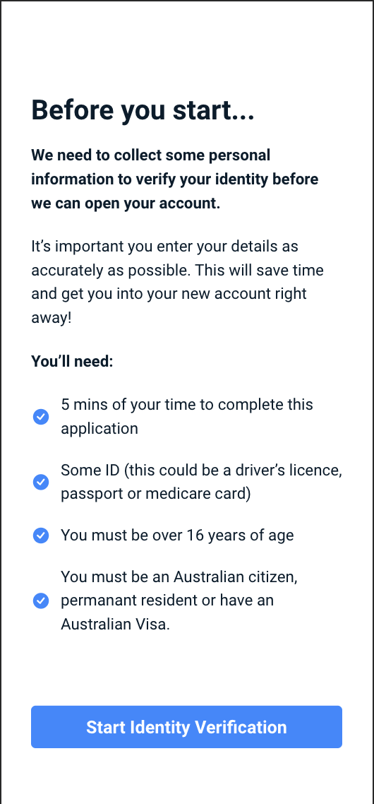

# Frankie Onboarding Widget

## Table of contents

- [Overview](#overview)
- [Getting started](#getting-started)
- [Configuration](#configuration)

You can execute a quick ExpressJS demo by runnig
```shell
npm run mk-ssl
```
Answer all the questions to generate ssl keys (to have a valid https connection)
And then
```shell
npm start
```

It's necessary to have a .env file in the root folder with the following variables
```
FRANKIE_API_KEY=...
FRANKIE_CUSTOMER_ID=...
FRANKIE_CUSTOMER_CHILD_ID=... <not required>
FRANKIE_API_URL=...
```

## Overview

A embedable widget to bring a self onboarding form to any web page...

**Features**:
1.  Some feature
2.  Another feature


Document selection


# Getting started


1.  Serialise and base64 encode your Frankie Api Credentials using ":" as a separator and POST it to Frankie Financial Client Api (details in the code snippet below)
    1.  "CUSTOMER_ID:API_KEY", if you don't have a CUSTOMER_CHILD_ID
    2.  "CUSTOMER_ID:CUSTOMER_CHILD_ID:API_KEY, otherwise
2.  The response header will contain a temporary api token
3.  Define your optional configuration object, according to the section [Configuration](#configuration)
4.  Add both the link to the Roboto font and the widget .js file to the head of the webpage
5.  Add the web component to the page, passing the following attributes
    1.  **ff**, the token
    2.  **applicant-reference**, the string reference that will be injected into this applicant's data and can be used to request  their details aftwerwards, both via Frankie API and Frankie Portal
    3.  *optional* **width**, the width exactly as would be defined in css (defaults to 375px)
    4.  *optional* **height**, the height exactly as would be defined in css (defaults to 812px)
    5.  *optional* **config**, the configuration object first stringified and then URI encoded. The algorithm needs to be compatible with Node's encodeURI. [Read more](#configuration)


## 1. Obtaining an API token
Example in Node + Express + Axios
```javascript
  // Have your Frankie credentials in hand
  const apiKey = process.env.FRANKIE_API_KEY,
        customerId = process.env.FRANKIE_CUSTOMER_ID,
        customerChildId = process.env.FRANKIE_CUSTOMER_CHILD_ID;
  // Serialize your credentials, by joining them with a ":" separator symbol
  //  customerId:customerChildId:apiKey OR customerId:apiKey
  //  where if you don't posses a customerChildId, you should omit it and the separator symbol ":" all together
  const decodedCredentials = [customerId, customerChildId, apiKey].filter(Boolean).join(":");
  // Base64 encode the resulting string
  const encodedCredentials = Buffer.from(decodedCredentials).toString('base64');
  // POST the endpoint "auth/v1/machine-session" of Frankie Client Api service, whose URL will be provided to you by Frankie
  // Include the encoded credentials in the "authorization" header, as follows
  // "authorization": `machine ${encodedCreentials}`
  // and extract the header "token" from the response
  const frankieUrl = process.env.FRANKIE_API_URL;
  axios.post(`${frankieUrl}/auth/v1/machine-session`, {}, {
    headers: { authorization: "machine " + encodedCredentials }
  }).then(response => {
    const headers = response.headers;
    const ffToken = headers.token;
    // pass the extracted token to the widget as an html attribute called 'ff' (see demo.ejs)
    res.render('the-web-page.ejs', {
      title: "Frankie Financial Widget Demo",
      ffToken: ffToken
    });
  })

```
## 2. Embeding widget
Head of the html page (link to font and the js file)
```html
  <head>
    <!-- viewport meta is recommended for responsive pages -->
    <meta name="viewport" content="width=device-width, initial-scale=1.0">
    <!-- initially only the Roboto font family is supported and therefore the following line is required to be included. This will be configurable in next iterations -->
    <link href="https://fonts.googleapis.com/css2?family=Roboto:ital,wght@0,300;0,400;0,700;1,300;1,400&display=swap" rel="stylesheet">
    <!-- Include the Web component script -->
    <script src="./ff-onboarding-widget.min.js"></script>
  </head>
```
Body of the html page, wherever desired
```html
<body style="margin: 0">
  <ff-onboarding-widget
    width="500px" height="900px"
    ff="<%= ffToken %>"></ff-onboarding-widget>
</body>
```

# Configuration
More configurations and customisations will be available soon. Right now our goals are the following.
- [x] Customize/Disable Welcome Screen
- [x] Customize accepted document types
- [x] Customize maximum attempt count
- [x] Hide the progress bar
- [x] Customize success page redirect url
- [ ] Customize text throughout the widget
- [ ] Customize font
- [ ] Customize all styles freely
- [ ] Customize success page content
- [ ] Customize progress bar range, start value and end value
- [ ] Dispatch events on every step of the progress of the user to allow greater interaction between the host platform and the widget
- [ ] Create public credentials that can be used directly by the frontend, with no backend required

## All current options and their defaults
```typescript
documentTypes: DocType[] = ['PASSPORT', 'DRIVERS_LICENCE', 'MEDICARE'],
welcomeScreen: boolean | {
  // html string to be displayed in the welcome screen. It accepts style tags, but script tags will be stripped out.
  // the default welcome screen is available in the screenshot after this section
  htmlContent: string | boolean = false,
  ctaText: boolean | string = "Start Identity Verification"
}
// the number of times the applicant will be allowed to review personal details and try new documents before failing their application
maxAttemptCount: number = 5
// By default only a
successScreen: {
  // url to redirect after applicant clicks button in the successful page
  // by default the widget only displays a successful message
  // you can always include the applicant-reference as a query parameter to continue any remaining onboarding steps that might come after the identity verification
  ctaUrl: string | false = false;
}
progressBar: boolean

```

Default welcome screen



## Passing the configuration object to the widget
Since HTML attributes can only be strings, the configuration object needs to be serialised and URI encoded before it's included in the attribute **config**
```javascript
encodeURI(JSON.stringify(widgetConfiguration));
```

```javascript
  const widgetConfiguration = {
    documentTypes: ['PASSPORT', 'DRIVERS_LICENCE', 'MEDICARE'],
    welcomeScreen: {
      htmlContent: `
        <h1 class='title'>The title</h1>
        <p class='bold'>We need to collect some personal information to verify your identity before we can open your account.</p>
        <p class='bold'>You�ll need</p>
        <ul style=''>
          <li>5 mins of your time to complete this application</li>
          <li>You must be over 16 years of age</li>
        </ul>
        <style>
          ul {
            list-style-image: url(/bullet.png);
          }
        </style>
      `,
      ctaLabel: 'Start now',
    },
    maxAttemptCount: 5,
  };
```
```html
<body style="margin: 0">
  <ff-onboarding-widget
    width="500px" height="900px"
    ff="<%= ffToken %>"
    config="<%- encodeURI(JSON.stringify(widgetConfiguration)) %>"></ff-onboarding-widget>
</body>
```